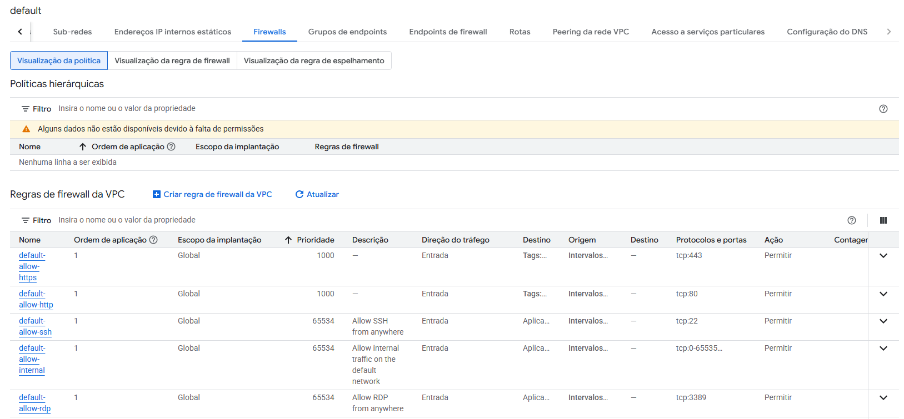

Este tutorial vai mostrar o passo a passo para realizar a implantação de um modelo 
usando o GCP Compute Engine


Casdastro no Google Cloud
Acessar Google Compute Engine (serviço do google que permite alugar instâncias de  VMs)
Clicar em Instâncias de VM
Clicar em Ativar (leva uns minutos)


Clicar em Criar instância
Selecione o tipo de máquina E2 micro, aba de SO seleciona Ubuntu:


Selecione a aba Rede e habilite tráfego http e https.


Clicar em Criar e aguardar uns minutos.

Instância criada:


Por padrão o Google deixas as portas da instância bloqueadas, é preciso realizar uma configuração adicional
para desbloquear a porta 5000 onde executa nossa API. Então acesse a instância que foi criada.
Clique em mais ações (3 pontinhos no lado direito), cliquei em Mais detalhes de rede.

Clique em default (Rede) em Detalhes na interface de rede


Clique na aba Firewalls


Clique em default-allow-http, clique em editar, procure pelo campo TCP e troque de 80 para 5000 e salve.

Acesse novamente a lista de instâncias de VM, clique na opção SSH.


O terminal da instância será aberto. O que precisa ser feito agora são os mesmos passos realizados localmente. 

- Atualizar a lista local de pacotes disponíveis nos repositórios, sem instalar ou atualizar softwares.
```
sudo apt-get update
```

- Instalar o git
```
sudo apt-get install git-all
```

- Baixar o repositório na instância
```
git clone https://github.com/ordepzero/tech_challenger_5_mlops_e2e.git
```

- Instalar o python com o pip
```
sudo apt install python3-pip
```

- Instalar o virtualenv
```
sudo apt install python3-virtualenv 
```

- Criar o ambiente virtual
```
virtualenv .venv
```

- Ativar o ambiente
```
source .venv/bin/activate
```

Ambiente criado e ativado


- Vamos instalar as depêndencias do projeto. Acesse o diretório do projeto e execute o comando e aguardar um tempinho
```
pip3 install -r requirements.txt
```

Precisei executar o comando
```
pip install --upgrade pip setuptools wheel
```

- Iniciar a aplicação FastAPI
```
fastapi run main.py --host 0.0.0.0 --port 8000
```

Testei no navegador acessando http:<IP_EXTERNO>:8000