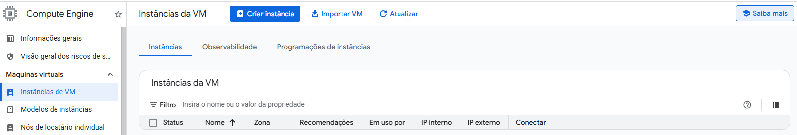
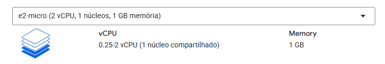

Este documento vai mostrar o passo a passo para realizar a implantação de um modelo 
usando o GCP Compute Engine

Casdastro no Google Cloud
Acessar Google Compute Engine (serviço do google que permite alugar instâncias de  VMs)
Clicar em Instâncias de VM
Clicar em Ativar (leva uns minutos)

Clicar em Criar instância
Selecione o tipo de máquina E2 micro

Selecione a aba Rede e habilite tráfego http e https.

Iniciar a aplicação FastAPI

fastapi dev src/app/main.py